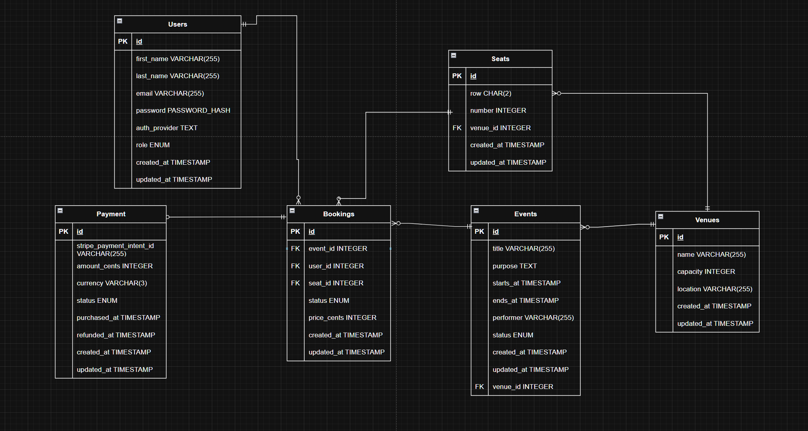

# EventHive Backend

Spring Boot 4 / Java 21 REST API for a ticketed-event booking platform. This document covers everything needed to run, understand, extend and test the service.

## Table of Contents

- [Highlights](#highlights)
- [Technology Stack](#technology-stack)
- [Running Locally](#running-locally)
- [Configuration](#configuration)
- [Project Structure](#project-structure)
- [Database Integration](#database-integration)
  - [ER Diagram](#er-diagram)
  - [Schema & Invariants](#schema--invariants)
  - [Schema Management](#schema-management)
  - [Seed Data](#seed-data)
- [Authentication & Authorization](#authentication--authorization)
- [Seat Locking](#seat-locking)
- [Booking & Payment Lifecycle](#booking--payment-lifecycle)
- [API Endpoints](#api-endpoints)
- [Error Handling](#error-handling)
- [Testing Strategy](#testing-strategy)
- [Conventions for Contributors](#conventions-for-contributors)
- [Operational Notes](#operational-notes)

## Highlights

- **Distributed seat locking** — `SETNX` + TTL in Redis, released via a Lua compare-and-delete so a lock is only ever dropped by its owner.
- **Defence in depth against overselling** — the Redis lock is the fast path; a Postgres partial unique index on `(event_id, seat_id) WHERE status IN ('PENDING','CONFIRMED')` is the authoritative guarantee.
- **Webhook-driven payment confirmation** — bookings are confirmed only by a signature-verified Stripe webhook, never by the HTTP request that initiated checkout.
- **Automatic duplicate refunds** — a payment that succeeds after the seat was confirmed to somebody else is detected and refunded, with the `Payment` row marked `REFUNDED`.
- **Refresh-token rotation with family revocation** — refresh tokens are hashed at rest, rotated on every use, and reuse of a revoked token revokes the entire token family.
- **Integration-first testing** — real Postgres via Testcontainers and real Redis; Stripe is the only mocked collaborator.

## Technology Stack

| Concern | Technology |
| --- | --- |
| Language | Java 21 (toolchain-pinned) |
| Framework | Spring Boot 4.1.0 |
| Build | Gradle (wrapper included) |
| Web | `spring-boot-starter-webmvc` |
| Persistence | Spring Data JPA / Hibernate, PostgreSQL |
| Migrations | Flyway |
| Cache & locking | Spring Data Redis |
| Security | Spring Security, OAuth2 Resource Server (JWT, HS256) |
| Validation | Jakarta Bean Validation |
| Payments | `com.stripe:stripe-java:33.4.2` |
| Boilerplate | Lombok |
| Testing | JUnit 5, Testcontainers (Postgres), Spring Security Test, Mockito |

Kafka and OAuth2 client starters are on the classpath as scaffolding for planned work; no Kafka producer/consumer or social-login flow is implemented yet.

## Running Locally

Infrastructure comes from the Compose file at the repository root. Note the **non-default ports** — they are hardcoded in `application.yaml` and in CI.

```bash
docker compose up -d          # Postgres on :5333, Redis on :6377
```

Then, from `backend/`:

```bash
./gradlew bootRun             # API on http://localhost:8181
./gradlew build               # compile + test + assemble
./gradlew test                # full test suite
```

`bootRun` has a custom task hook in `build.gradle` that reads `backend/.env` line by line and injects each `KEY=value` pair into the process environment. The file is not committed; without it the application will fail to start on unresolved placeholders.

Stripe webhooks in local development require the Stripe CLI to forward events to the service:

```bash
stripe listen --forward-to localhost:8181/api/v1/stripe/webhooks
```

The CLI prints a `whsec_...` signing secret — that is the value for `STRIPE_SIGNING_KEY`. A manual checkout harness is served at `http://localhost:8181/checkout-test.html`, with `success.html` and `cancel.html` as the Stripe redirect targets.

## Configuration

All configuration lives in `src/main/resources/application.yaml`; secrets are supplied through the environment.

| Variable | Used for |
| --- | --- |
| `DB_USERNAME` / `DB_PASSWORD` | Postgres credentials (`jdbc:postgresql://localhost:5333/eventhive_dev`) |
| `JWT_SECRET_KEY` | HS256 signing key for access tokens — must be at least 32 bytes |
| `ADMIN_EMAIL` / `ADMIN_PASSWORD` | Credentials for the bootstrap admin created by `AdminSeeder` |
| `STRIPE_SECRET_KEY` | Stripe API key, applied globally in `PaymentConfig` |
| `STRIPE_PUBLISH_KEY` | Stripe publishable key (used by the checkout test page) |
| `STRIPE_SIGNING_KEY` | Webhook signature verification secret |

Other notable settings:

| Setting | Value | Why |
| --- | --- | --- |
| `server.port` | `8181` | Avoids clashing with a frontend dev server |
| `spring.jpa.hibernate.ddl-auto` | `validate` | Flyway owns the schema; Hibernate only checks it matches |
| `spring.jpa.open-in-view` | `false` | No lazy loading during view rendering; services must fetch what they return |
| `spring.flyway.repair` | `true` | Repairs checksum drift on start in development |
| `eventhive.seed.enabled` | `true` | Gates all seeders; disabled in tests |

## Project Structure

```
com.eventhive
├── users/        User, roles, registration, admin user creation
├── venues/       Venue aggregate + its seats and events
├── seats/        Seat aggregate, filtering specifications
├── events/       Event aggregate and lifecycle status
├── bookings/     Booking aggregate — orchestrates lock + checkout + confirmation
├── payments/     Payment records mirroring Stripe state
├── auth/         Login, registration, JWT minting
│   └── refresh/  Refresh-token rotation, family revocation
├── security/     SecurityConfig, UserPrincipal, UserDetailsService
├── redis/        SeatLockService (and a Redis smoke-test controller)
├── stripe/       Hosted checkout, refunds, webhook listener
├── config/       Stripe bootstrap + ordered data seeders
└── exception/    Domain exceptions, ApiError, GlobalExceptionHandler
```

Each domain slice follows the same layout, and new slices are expected to match it:

| File | Role |
| --- | --- |
| `Xxx.java` | JPA entity |
| `XxxRepository.java` | Spring Data repository, including projection queries |
| `XxxService.java` | Business logic; the only layer that touches repositories |
| `XxxController.java` | HTTP mapping, validation entry point, `@PreAuthorize` rules |
| `XxxDTO` + `XxxDTOMapper` | Response record plus a `Function<Entity, DTO>` registered as a bean |
| `XxxRegistrationRequest` / `XxxUpdateRequest` | Request records carrying Bean Validation annotations |
| `XxxSecurity` | Named component (`@Component("xxxSecurity")`) used from SpEL for ownership checks |

`XxxSummaryDTO` types are narrow projections used to expose one aggregate from another's endpoints without leaking entities. They live in the package of the aggregate being *described*, not the one doing the describing — for example `venues.EventSummaryDTO` is what `/bookings/{id}/event` returns.

Dependencies are injected through Lombok's `@RequiredArgsConstructor` on `final` fields.

## Database Integration

### ER Diagram



### Schema & Invariants

Seven tables: `users`, `venues`, `seats`, `events`, `bookings`, `payments`, `refresh_tokens`. All primary keys are `UUID` defaulted to `gen_random_uuid()`; all timestamps are `TIMESTAMP WITH TIME ZONE`.

The constraints below are load-bearing — they are the reason the system cannot oversell, and they should be understood before changing any write path.

| Constraint | Table | Guarantees |
| --- | --- | --- |
| `booking_event_seat_active_unique` — partial unique index on `(event_id, seat_id) WHERE status IN ('PENDING','CONFIRMED')` | `bookings` | One live booking per seat per event, while still allowing `EXPIRED`/`CANCELLED` rows to accumulate as history |
| `unique_payment_intent_id` on `stripe_payment_intent_id` | `payments` | Webhook redelivery cannot create a second payment row |
| `unique_payment_booking_id` on `booking_id` | `payments` | A booking can carry at most one payment |
| `chk_password_or_oauth` | `users` | `LOCAL` users must have a password hash; federated users must not |
| `UNIQUE(seat_row, number, venue_id)` | `seats` | No duplicate seat labels within a venue |
| `UNIQUE(email)` | `users` | Email is the login identity |

Foreign keys are explicitly indexed (`idx_seats_venue_id`, `idx_bookings_user_id`, `idx_bookings_event_id`, `idx_bookings_seat_id`, `idx_payments_booking_id`, `idx_refresh_tokens_user_id`), since Postgres indexes primary keys but not foreign keys.

Enumerations are stored as strings:

| Enum | Values |
| --- | --- |
| `UserRole` | `USER`, `EVENT_ORGANISER`, `ADMIN` |
| `AuthProvider` | `LOCAL`, `GOOGLE` |
| `EventStatus` | `DRAFT`, `PUBLISHED`, `CANCELLED`, `COMPLETED` |
| `BookingStatus` | `PENDING`, `CONFIRMED`, `EXPIRED`, `CANCELLED` |
| `PaymentStatus` | `SUCCEEDED`, `FAILED`, `REFUNDED` |

### Schema Management

Flyway owns the schema; Hibernate runs in `validate` mode. **Any schema change requires a new versioned migration** in `src/main/resources/db/migration` — changing an entity alone will fail startup validation.

| Migration | Change |
| --- | --- |
| `V1__database_schema_init.sql` | Core six tables, FK indexes, password/OAuth check constraint |
| `V2__refresh_token_schema.sql` | `refresh_tokens` with `parent_id`, `replaced_by_id` and `family_id` for rotation tracking |
| `V3__unique_constraint_payment_intent_id.sql` | Idempotency for webhook-created payments |
| `V4__payments_amount_cents_update_type.sql` | `amount_cents` widened to `BIGINT` to match Stripe's `Long` amounts |
| `V5__bookings_unique_constraint_with_status.sql` | Replaced the blanket `UNIQUE(seat_id, event_id)` with the status-scoped partial index |
| `V6__payments_booking_id_unique.sql` | One payment per booking |

### Seed Data

`config/*Seeder.java` are `ApplicationRunner` beans gated on `eventhive.seed.enabled=true` and ordered with `@Order` so referential dependencies resolve: `VenueSeeder` → `SeatSeeder` → `EventSeeder` (`@Order(3)`), alongside `AdminSeeder` which creates the bootstrap admin from `ADMIN_EMAIL`/`ADMIN_PASSWORD`. Seeders are idempotent (they check for existing rows) and seeded event dates are computed relative to startup so demo events are always upcoming. Seeding is disabled in tests.

## Authentication & Authorization

### Token model

**Access token** — JWT, HS256, signed with `jwt.secret`, **15-minute** lifetime, minted by `JwtTokenService`. Claims: `sub` (email), **`userId`** (the UUID used by every ownership check), and `roles` (role names with the `ROLE_` prefix stripped). Sent as `Authorization: Bearer <token>`; the service is a stateless OAuth2 resource server with `SessionCreationPolicy.STATELESS` and CSRF disabled.

**Refresh token** — a 256-bit `SecureRandom` value, returned only in an HTTP-only, `Secure`, `SameSite=Strict` cookie scoped to `/api/v1/auth`, **7-day** lifetime. Only the SHA-256 hash is stored. `RefreshTokenService.rotateAndGetNewToken` issues a new token on every refresh, marks the old one revoked and links `parent_id`/`replaced_by_id`.

**Reuse detection** — every token carries a `family_id`. Presenting an already-revoked token means the token was stolen or replayed, so `TokenFamilyRevoker.revokeFamily` (running in `REQUIRES_NEW` so the revocation survives the rejecting transaction's rollback) revokes the whole family and the request fails with `401`.

### Authorization layers

Two layers must be kept in sync when adding an endpoint:

1. **Path/method rules** in `SecurityConfig.filterChain`, matched against `/api/v*/...`.
   - Public: `auth/login`, `auth/register`, `auth/refresh-token`, `stripe/webhooks`, `redis-example`, `POST /users/registration`, and static assets.
   - Authenticated: all `GET`s on the domain resources, `POST /bookings/**`, `PUT /users/**`.
   - `EVENT_ORGANISER` or `ADMIN`: writes under `/events/**`.
   - `ADMIN` only: `/venues/**`, `/seats/**` writes and `/users/**` administration.
2. **Method-level `@PreAuthorize`** for ownership, enabled by `@EnableMethodSecurity` and expressed against the named security beans:

   ```java
   @PreAuthorize("hasRole('ADMIN') or @bookingSecurity.isOwner(#id, authentication.token.claims['userId'])")
   ```

   `userSecurity.isSelf`, `bookingSecurity.isOwner` and `paymentSecurity.isOwner` each resolve the resource and compare its owner to the `userId` claim.

Passwords are hashed with BCrypt. Responses carry a `default-src 'self'` CSP, `X-Frame-Options: DENY` and `Referrer-Policy: strict-origin-when-cross-origin`. Authentication and access-denial failures are rendered as `ApiError` JSON through custom entry-point and access-denied handlers rather than Spring's defaults.

## Seat Locking

`redis.SeatLockService` is the concurrency primitive.

- **Key** — `seat-lock:{eventId}:{seatId}`
- **Value** — the locking user's UUID, so ownership is provable
- **TTL** — 5 minutes, so a crashed or abandoned checkout self-heals
- **Acquire** — `SETNX` (`setIfAbsent`), which is atomic; a `false` return means somebody else holds the seat and the caller raises `SeatAlreadyLockedException` (HTTP `409`)
- **Release** — `scripts/releaseLock.lua`, executed server-side:

  ```lua
  local currentUser = redis.call('GET', KEYS[1])
  if currentUser == ARGV[1] then
      return redis.call('DEL', KEYS[1])
  else
      return 0
  end
  ```

  A plain `DEL` would let a slow request delete a lock that had already expired and been re-acquired by a different customer. The Lua script makes the check-and-delete atomic and owner-scoped. **Never release a seat lock any other way.**

The lock is an optimisation for the common case, not the system of record — the partial unique index on `bookings` is what makes overselling impossible even if Redis is unavailable, lags, or a lock expires mid-checkout.

## Booking & Payment Lifecycle

### Happy path

1. `POST /api/v1/bookings` with `{ priceCents, eventId, seatId }`. The user is taken from the JWT's `userId` claim, never from the request body.
2. `BookingService.addBooking` loads user, event and seat, then calls `seatLockService.tryLock`. Failure → `409 SeatAlreadyLockedException`.
3. A `Booking` is persisted with status `PENDING`.
4. `StripeHostedCheckoutService.checkout` creates a Stripe Checkout Session: AUD line item priced from the booking, `bookingId` in session metadata, an expiry ~31 minutes out (Stripe requires 30 min–24 h), and an idempotency key of `idem_{bookingId}` so a retried request cannot create a second session.
5. The response (`BookingRegistrationResponse`) carries the booking DTO plus the Stripe-hosted `url` to redirect the customer to.
6. Stripe calls `POST /api/v1/stripe/webhooks`. `WebhookController` verifies the signature against `stripe.webhook.signing`, then dispatches on event type.
7. `checkout.session.completed` → `BookingService.handleSuccessPayment`: booking becomes `CONFIRMED` and a `Payment` row is written with the payment intent id, amount, currency and `SUCCEEDED`.

Any `RuntimeException` between lock acquisition and the response releases the lock before rethrowing, so a failed attempt does not hold the seat for five minutes.

### Failure and race paths

| Scenario | Handling |
| --- | --- |
| `checkout.session.expired` | `handleExpiredPayment` sets the booking to `EXPIRED` and releases the seat lock, freeing the seat immediately rather than waiting for the TTL |
| Stripe `CardException` during session creation | Lock released, `402 PaymentRequiredException` |
| Other `StripeException` during session creation | Lock released, the `PENDING` booking is deleted, `502 PaymentProcessingException` |
| Webhook redelivery for an already-confirmed booking, same payment intent | Recognised as a duplicate and treated as a no-op (logged) |
| **Payment succeeds after the seat was confirmed to someone else** (lock TTL expired while the customer was on Stripe's page) | `StripeService.initiateRefund` issues a `DUPLICATE`-reason refund keyed on `idem_{paymentIntent}`, and the existing `Payment` is marked `REFUNDED` — the customer is made whole and the seat is not oversold |
| `DELETE /bookings/{id}` on a `CONFIRMED` booking | Rejected with `409 IllegalStateTransitionException`; deleting a non-confirmed booking releases its lock first |

Both webhook handlers are `@Transactional`, and every confirmation path is idempotent because Stripe guarantees at-least-once delivery.

## API Endpoints

Base path `/api/v1`. All responses are JSON. `🔓` = public, `🔑` = any authenticated user, `👤` = owner or `ADMIN`, `🎪` = `EVENT_ORGANISER` or `ADMIN`, `🛡️` = `ADMIN` only.

### Auth — `/auth`

| Method | Path | Access | Description |
| --- | --- | --- | --- |
| `POST` | `/login` | 🔓 | `{ username, password }` → access token in the body, refresh token in a `Set-Cookie` |
| `POST` | `/register` | 🔓 | Creates a `USER`, returns `201` with access token + user DTO and sets the refresh cookie |
| `POST` | `/refresh-token` | 🔓 (cookie) | Rotates the refresh cookie and returns a fresh access token |
| `POST` | `/logout` | 🔑 | Revokes the presented refresh token and clears the cookie |
| `POST` | `/logout-all` | 🔑 | Revokes every refresh token for the user |

### Users — `/users`

| Method | Path | Access | Description |
| --- | --- | --- | --- |
| `GET` | `/` | 🛡️ | Paged and searchable: `pageNo` (1-based, default 1), `pageSize` (20), `sortBy` (`+field` / `-field`, default `+firstName`), `search` |
| `GET` | `/{userId}` | 👤 | Single user |
| `POST` | `/registration` | 🔓 | Self-service registration |
| `POST` | `/` | 🛡️ | Admin creation with an explicit target `role` |
| `PUT` | `/{userId}` | 👤 | Update profile |
| `DELETE` | `/{userId}` | 🛡️ | `204` |
| `GET` | `/{userId}/bookings` | 👤 | The user's bookings |

### Venues — `/venues`

| Method | Path | Access | Description |
| --- | --- | --- | --- |
| `GET` | `/` · `/{venueId}` | 🔑 | List / fetch venues |
| `POST` · `PUT` · `DELETE` | `/` · `/{venueId}` | 🛡️ | Manage venues |
| `GET` | `/{venueId}/events` · `/{venueId}/seats` | 🔑 | Events hosted at, and seats belonging to, the venue |

### Events — `/events`

| Method | Path | Access | Description |
| --- | --- | --- | --- |
| `GET` | `/` · `/{eventId}` | 🔑 | List / fetch events |
| `POST` · `PUT` · `DELETE` | `/` · `/{eventId}` | 🎪 | Manage events; `startsAt`/`endsAt` must be in the future and correctly ordered |
| `GET` | `/{eventId}/host` | 🔑 | The hosting venue |
| `GET` | `/{eventId}/bookings` | 🎪 | Bookings for the event |

### Seats — `/seats`

| Method | Path | Access | Description |
| --- | --- | --- | --- |
| `GET` | `/` | 🔑 | Paged (`pageNo` 1-based, `pageSize` 50) and filterable by `seatRow` / `number` via JPA `Specification`s; always sorted by row then number |
| `GET` | `/{seatId}` · `/{seatId}/host` | 🔑 | Seat, and its venue |
| `POST` · `PUT` · `DELETE` | `/` · `/{seatId}` | 🛡️ | Manage seats |

### Bookings — `/bookings`

| Method | Path | Access | Description |
| --- | --- | --- | --- |
| `GET` | `/` | 🛡️ | All bookings |
| `GET` | `/{bookingId}` | 👤 | Single booking |
| `POST` | `/` | 🔑 | **Create a booking** — locks the seat and returns the Stripe checkout URL (`201`) |
| `PUT` | `/{bookingId}` | 🛡️ | Adjust price or seat |
| `DELETE` | `/{bookingId}` | 🛡️ | Blocked for `CONFIRMED` bookings |
| `GET` | `/{bookingId}/user` · `/event` · `/seat` · `/payments` | 👤 | Related resources as summary DTOs |

### Payments — `/payments`

| Method | Path | Access | Description |
| --- | --- | --- | --- |
| `GET` | `/` | 🛡️ | All payments |
| `GET` | `/{paymentId}` · `/{paymentId}/booking` | 👤 | Payment and its booking |
| `PUT` | `/{paymentId}` | 🛡️ | Administrative correction |

Payments are never created or deleted over HTTP — they exist only as a consequence of Stripe webhooks.

### Stripe — `/stripe/webhooks`

| Method | Path | Access | Description |
| --- | --- | --- | --- |
| `POST` | `/` | 🔓 (signature-verified) | Consumes `checkout.session.completed` and `checkout.session.expired`; unknown event types are logged and ignored |

## Error Handling

Every error is rendered by `GlobalExceptionHandler` as an `ApiError`:

```json
{
  "path": "/api/v1/bookings",
  "message": "Seat is currently reserved by another customer 7f3c…",
  "statusCode": 409,
  "localDateTime": "2026-09-17T10:15:30.123"
}
```

Controllers must throw domain exceptions rather than build error responses.

| Exception | Status |
| --- | --- |
| `ResourceNotFoundException` | `404 Not Found` |
| `RequestValidationException`, `MethodArgumentNotValidException`, `HandlerMethodValidationException`, `HttpMessageNotReadableException`, `MissingRequestCookieException`, `IllegalArgumentException`, `SignatureVerificationException` | `400 Bad Request` |
| `AuthenticationException`, `BadCredentialsException` | `401 Unauthorized` |
| `PaymentRequiredException` | `402 Payment Required` |
| `AccessDeniedException` | `403 Forbidden` |
| `DuplicateResourceException`, `DataIntegrityViolationException`, `SeatAlreadyLockedException`, `IllegalStateTransitionException` | `409 Conflict` |
| `PaymentProcessingException` | `502 Bad Gateway` |
| Anything else | `500 Internal Server Error` |

Bean Validation failures are flattened into a single `field: message; field: message` string.

## Testing Strategy

```bash
./gradlew test
./gradlew test --tests "com.eventhive.integration.BookingIntegrationTest"
./gradlew test --tests "*BookingIntegrationTest.shouldCreateBooking"
```

The suite is deliberately integration-heavy: the behaviour worth protecting here (constraints, locking, transactional boundaries, security rules) does not survive being mocked out.

### Base classes

| Class | Purpose |
| --- | --- |
| `TestContainerInitialiser` | Starts a single static `postgres:16.0` Testcontainer in a static initialiser, wired in by `@ServiceConnection`. One container for the whole JVM, shared by every test class, torn down when the JVM exits. |
| `AbstractRepositoryTest` | `@DataJpaTest` with `@AutoConfigureTestDatabase(replace = NONE)` so the real container is used instead of an in-memory database. For entity mapping, constraints and query correctness. |
| `AbstractWebIntegrationTest` | `@SpringBootTest(webEnvironment = RANDOM_PORT)` with fake JWT, admin and Stripe properties injected via `@TestPropertySource`; truncates every table after each test through `TestUtility.clearDatabase`. |

### Coverage

- `entity/` — `BookingRepositoryTest`, `PaymentRepositoryTest`, `SeatRepositoryTest`, `EventRepositoryTest`.
- `integration/` — per-domain HTTP tests (`User`, `Venue`, `Event`, `Seat`, `Booking`, `Payment`), `AuthIntegrationTest` for login/rotation/revocation, `RedisLockTest` for lock acquisition and owner-scoped release, and `StripePaymentIntegrationTest` for checkout, webhook confirmation, expiry and the duplicate-refund race.

### Rules when adding tests

- **Add every new table to the `TRUNCATE` list in `TestUtility.clearDatabase`**, or state will leak between tests.
- Stripe is mocked with `@MockitoBean`; do not call the live API from tests.
- `RedisLockTest` needs a real Redis on `6377` — from Compose locally, and from a service container in CI.
- Seeding stays off in tests (`eventhive.seed.enabled=false`); build the fixtures the test needs.

### CI

`.github/workflows/ci.yaml` runs on pull requests to `main`: JDK 21 (Temurin) with a Gradle cache, a `redis:7-alpine` service container on `6377` with a health check, then `./gradlew test`. Postgres is not a service container — Testcontainers starts it.

## Conventions for Contributors

- Follow the slice layout above; a new domain gets the same file set.
- Services own repositories. Controllers do HTTP and authorization only; entities never cross the controller boundary — map to a DTO.
- Requests and responses are Java `record`s. Validation lives on the request record, including compact-constructor checks for cross-field rules (see `EventRegistrationRequest`).
- Identity always comes from the JWT `userId` claim, never from a request body or path parameter that a client could forge.
- Every schema change ships as a new `V{n}__description.sql`.
- Add both the `SecurityConfig` matcher and the `@PreAuthorize` rule for any new endpoint.
- Money is stored in minor units (`priceCents`, `amountCents`); `amountCents` is `Long` to match Stripe.

## Operational Notes

- **Ports** — `8181` (API), `5333` (Postgres), `6377` (Redis). The non-standard datastore ports are intentional, to avoid clashing with local installations.
- **Redis is required at runtime.** Booking creation fails if it is unreachable; browsing and authentication continue to work.
- **Webhook reachability is a hard dependency for payments.** Without a tunnel or the Stripe CLI forwarding events, bookings stay `PENDING` until their session expires.
- **Known rough edges** — Stripe success/cancel URLs are hardcoded to `localhost:8181` placeholders pending the frontend; `WebhookController` logs full payloads and `AuthController` prints cookies to stdout, both of which should be trimmed before any real deployment; CORS is not yet configured for a separately-hosted frontend.
